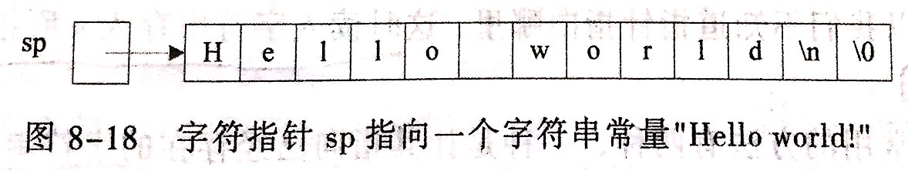

#什么是指针
>引言： 在C语言中，内存地址对于程序员来说是可操作的。用于表示内存地址的数据项，就称为指针。

---

##相关概念

######内存地址
* 现代计算机把内存分割成**字节**，每个字节可以存储8位。
* 每个字节都有一个唯一的编号，这个编号称为**内存地址**。
* 一个内存地址只占**4个字节**,是一个**整数值**。
* 程序中每个变量占用内存中的一个或多个字节，把其占用的第一个字节的地址称为变量的**地址**。
* **直接引用：**使用变量名引用变量的方法。<br>**简介引用：** 知道某个数据的数据类型，然后通过它的内存地址进行引用的方法。

######指针变量的声明
当"*"以这种形式出现在变量定义中，它表示在被定义的变量是一个指针。**指针可以被定义为指向任何数据类型的对象**。

```c
int *i;   //声明i是一个指向整型数据的指针(没有赋值初始化)。
```

######指针变量的初始化
**指针变量在使用时，必须赋初值**。指针变量可以被初始化NULL(<stdio.h>中定义的符号常量)、0或一个地址。值为NULL的指针表示它不指向任何对象。将指针初始化为0等价于初始化为NULL(但初始化为NULL更好，因为用0为指针赋值时，它需要被转化为相应类型的指针).

>在计算机编程领域中，迷途指针，或称悬空指针、野指针，指的是不指向任何合法的对象的指针。
--wiki

如果指针没有完成初始化，谁也不知道指针指向了哪里，此时被拿来使用，会造成非法内存访问，编译器报错。


######指针和数据类型
例如，如下语句：
```c
int count = 1000, *cntptr;
cntptr = &count;/* 指针变量cntptr包含的信息是，count的地址和它的数据类型为int。*/
```
所以，每个指针都和某个数据类型相关联。如果某一个指针变量被声明int类型(或其，那么该指针变量就只能指向整型变量，而不能指向其他类型的变量。**仅在类型相同时，一个指针才能赋值给另一个指针**。

**void类型的指针**，它是可以表示任何类型的通用指针——void类型的指针可以和其他任何类型的指针相互赋值，都无需使用类型转换运算符。但是，指向void类型的指针，不能进行间接寻址运算，因为void类型的指针只是简单地包含一个未知数据类型的首地址，这个指针一次读取的字节数对编译器而言是未知的。

######指针的基本运算——间接寻址运算和赋值运算。
&：取地址运算符。以左值为操作数，返回操作数所在的内存地址。

\*：取指针所指内存对象的数据。"*"通常被称为间接寻址运算符(indirection operator),它返回其操作数(即一个指针)指向对象的值。例如，语句：
```C
int count = 1000, *cntptr;
cntptr = &count; //将变量count的地址赋值给指针变量cntptr
printf("%d\n",*cntptr); //等价于printf("%d\n",count)
/* count和*cntptr具有等价关系，也可以说*cntptr是对count的引用 */
```

##指针作为函数的参数
>向函数传递实参的方法有两种：**按值传递和按引用传递**。C语言中，所有实参都是按值传递的，在发生函数调用时，系统为被掉
·函数的形参分配新的内存，将实参的值复制到对应的形参变量中。形参只是实参的副本，在被掉函数函数中访问这个参数，只是访问实参的副本，对调用函数中的实参没有任何影响。C语言的这种按值传递的机制，符合“最小权限原则”，即减小被掉函数的权限，避免**被掉函数**修改**主调函数**中的变量。

当函数需要把多个值返回主调函数时，用return语句返回就不合适了。解决这个问题的办法就是写成一个不需要返回值的过程，通常指针作函数参数的方法实现，具体实现：

1. 在主调函数中，将该变量的地址作为实参；
2. 在被掉函数中，定义一个指针类型的形参来接收这个地址；
3. 在被掉函数中，用形参指针间接访问主调函数中的变量。 

---

##指针与const限定符
>const限定符的作用是告诉编译器这个被const限定的变量的值是不可改写的。可以使用const限定符实现“最小权限原则”。如果有语句试图改写一个声明为const的变量的值，那么编译器会检测出这个错误并发出警告或错误提示。使用指向常量的指针来传递大的数据结构，能达到“按值调用”的安全性。

######1.指向可变数据的可变指针
**程序：将一个字符串中所有小写字母转换为大写字母。**
```C
#include<stdio.h>
#include<ctype.h>
void ConvertToUpper(char *sptr);

int main (void)
{
    char str[100];
    gets(str);
    ConvertToUpper(str);
    puts(char);
    return 0;
}

/* 把字符串全转化为大写 */
void ConvertToUpper(char *sptr)
{
    for(; *sptr != '\0'; sptr++)
        *sptr = toupper(*sptr);z 
}
```
ConvertToUpper()函数的形参指针sptr是指向可变数据的可变指针，拥有最高数据访问权限。函数不仅可以通过间接访问改写sptr所指向的存储单元中的数据，还可以改写sptr的值，使其指向其他的数据项。

######2.指向常量数据的可变指针
这种情况下，形参可以改变指向，但不能改变其所指向的存储单元的数据。

**程序：输出字符串，形参声明为指向常量数据的指针变量**。
```C
void PrintStr(const char *sptr)
{
    for(; *sptr != '\0'; *sptr++)
        putchar(*sptr);
}
```
其中，形参的定义形式为：
```C
const char *sptr
```
这个声明**从右向左**念做“**sptr是一个指针，指向字符常量**”。如果试图改变sptr所指内存单元的内容，则出现编译错误。

######3.指向可变数据的指针常量
一个指向可变数据的指针常量，指向总是不变的，而存储在指向的内存单里的数据可以通过指针来改写。**数组名就是这种指针常量，总是指向数组的起始位置。而数组的所有元素都可以通过数组名加下标来访问和改写。**

**声明为const的指针，必须在定义的同时初始化，如果指针是函数的参数，那么它由传递给函数的实参来初始化。**

**程序：试图修改指针常量的指向，非法的**。
```C
#include<stdio.h>

int main (void)
{
    int x, y;
    /* 声明ptr是一个指向可变数据的指针常量 */
    int * const ptr =&x; //这个定义从右向左读：ptr是指针常量，指向一个整型数据。

    *ptr = 5; /*合法*/
    ptr = &y; /*不合法，ptr只一个指针常量，不能改变指向*/
    return 0;
}
```

######4.指向常量数据的指针常量
**/*程序：试图修改指向常量的指针常量，或者试图修改指针所指内存都是非法的。***/
```C
#include<stdio.h>

int main (void)
{
    int x, y;

    /*声明ptr是一个指向常量数据的指针常量*/
    const int * const ptr = &x;

    *ptr = 5; /*非法，*ptr指向的存储单元的数据为整型常量，不能改变其值*/
    ptr = &y;/*非法，ptr的是一个指针常量，不能改变指向*/
    return 0;
}
```

---

##一维数组与指针
>指针的值是一个变量或常量的地址，使用指针可以在不同的时间访问不同的变量，只要他们的类型相同即可。<br>指针和数组有密切的关系，**凡是由数组下标完成的操作皆可用指针来实现**，这与C语言编译器对数组的处理方式有关。

####指针的算术运算和关系运算
* 间接寻址运算
* 赋值运算
* 加/减一个整数运算
* 两个指针相减运算
* 指针比较运算

**——指针的运算就是地址的运算**

######指针加/减一个整数运算
指针与一个整数相加/减的结果是另一个指针。

*举例说明：*指针每增1，指针所指向的内存地址的增量是其所指向类型的大小（字节数），即指向下一个同类型元素。

**/* 程序：指针变量增1，指针中存储的地址值增加多少   \*/**

```C
#include<stdio.h>

int main()
{
    double a[4] = {1.5,2,3,4};
    double *p;

    p = &a[0];
    printf("p中存储的地址值：%p\n", p);
    printf("p所指变量的值：%.1f\n",*p);

    p = p + 1;  /* p指向下一个元素 */
    printf("p中存储的地址值：%p\n", p);
    printf("p所指变量的值：%.1f\n",*p);

    return 0;
}

/*运行结果：
  p中存储的地址值：0012FF60
  p所指变量的值：1.5
  p中存储的地址值：0012FF68
  p所指变量的值：2.0
*/

/*p是指向double类型的指针,一个元素占8个字节。*/
```

######指针相减
同类型的两个指针可以相减，其结果为两个指针之间的距离——这个距离是用元素的个数度量，而不是用字节数度量。

**程序：指针相减与指针的地址值相减**
```C
double a[5], *p, *q;
*p = a[0];
*q = a[2];
printf("%d\n",(int)q - (int)p); /*内存地址值的差*/
printf("%d\n", q - p); /*指针的差*/

/*运行结果：
8
2
*/
```

######指针比较
可以用关系运算符进行指针的比较，但只有两个指针指向同一数组时，指针的比较才有意义。

**程序：指针可以比较大小，通过指针的移动和比较控制循环的进行**
```C
int a[5] = {2, 4, 6, 8, 10};
int *p ,*q;

*p = a[0];  /* p指向a[0],即数组的第一个元素 */
*q = a[4];  /* q指向数组的最后一个元素 */

/*循环打印数组的元素*/
for ( ; p <= q; p++ )
    printf("%d \n",*p);

/*运行结果：
2 4 6 8 10
*/
```

####指针与数组的关系
######1.数组名

在声明一个数组时，编译器将根据声明所指定的元素个数及类型为数组分配空间，并将数组名与数组的起始地址和所占内存字节数等信息相关联。所以，通过**数组名**,可以获得两个信息：<br>
(1) 确定该数组的大小。
```c
int a[8];
printf("%d\n",sizeof(a)); /*将输出数组a所占内存字节数*/
```

(2)获得指向该数组小标为0的元素的指针。

数组名如果不是用于sizeof的操作数，在其他的使用场合总是会被装换成指向数组的起始元素的**指针常量**。

**数组作函数参数的本质：**数组名在参数传递时，总是被视作指针。数组名作为实参时，因数组名是指针常量，形参应该是同类型的指针变量。比如：
```C
int function(int array[]) ==> int function(int *array)
/*形参数组声明为：int array[],看起来像是数组，但本质上是指针。
   这也解释了函数中的数组能够影响main函数中的数组，因为它并不是“按值传递”规则，
   函数可以直接对main函数中的数据进行修改，既不符合“最小权限准则” */
```
所以，数组做实参时，形参获取了实参数组的首元素指针，可以访问和修改实参数组的所有元素，这和普通变量具有明显的区别。当然如果不希望实参数组的值被改变，可以用const来修饰形参数组。

参数传递时将数组作为指针的好处是只传递首元素地址，数组本身并没有被复制，从而减小参数传递的代价。

**/*程序：数组求和函数sum1()和sum2()\*/**
```C
/*作为形参声明，int arr[] ==> int *arr */
int sum1(const int arr[], int n)
{
    int sum = 0;
    int *end = arr + n -1;

    for( ; arr <= end; arr++)
        sum = sum + *arr;

    return sum;
}

/*函数sum2()中，形参指针arr被声明为常量，不可像sum1()中那样做循环变量，采用下标法引用数组元素*/
int sum1(const int *const arr, int n)
{
    int sum = 0;
    int i = 0;

    for( ; i < n ; i++)
        sum = sum + arr[i];  /*用指针下标法引用数组元素*/

    reutn sum;
}

```

######2. 数组的下标与指针的关系
对数组的引用，如a[i],在编译时总是被编译器改写为*(a + i)形式；如果指针变量ptr的值是数组a的首地址，则表达式ptr[i]就是对数组元素a[i]的引用。

对于一个数组，第i个元素的引用方法有以下4种：

(1)数组名下标法：a[i]<br>
(2)数组名偏移量法：\*(a+i)<br>
(3)指针下标法：ptr[i]<br>
(4)指针偏移量法：\*(ptr + i)

 **/\* DEMO：用多种方法访问数组元素，实现逆序输出。 */**
```C
#include<stdio.h>
#define N 100

int main (void)
{
    
    int n, intArry[N];
    int * ptr = intArry;
    int i; //i是一个计数器
    

    scanf("%d",&n);

    for(i = 0; i < n; i++)
        scanf("%d",intArry + i);

    /*用数组名下标法引用数组元素*/
    for(i = n - 1; i >= 0; i--)
        printf("%d ",intArry[i]);
    
    printf("\n");

    /*用数组名偏移量法引用数组元素*/
    for(i = n - 1; i >= 0; i--)
        printf("%d ", *(intArry + i));
    
    printf("\n");

    /*用指针偏移量法引用数组元素*/
    for(i = n - 1; i >= 0; i--)
        printf("%d ", *(ptr + i));
    
    printf("\n");

    /*用指针下标法引用数组元素*/
    for(i = n - 1; i >= 0; i--)
        printf("%d ", ptr[i]);
    printf("\n");

    /*用移动指针法遍历数组元素*/
    for(ptr = intArry + n -1; ptr >= intArry; ptr--)
        printf("%d ", *ptr);
    
    printf("\n");

    return 0;
}
```

---

##指针与字符串

######字符串常量

开始的开始，和大多数初学者一样，我也是以一个著名的"Hello World"程序开始了C语言的学习。勿忘初心，接下来好大的一段都是回归"Hello World"那段程序，不过，你已经不再是原来的那个太过无知的备了。再次回到"Hello World", 它没有变，世界没有变，你的眼界已经变了。
```C
#include<stdio.h>
int main (void)
{
    printf("Hello World\n");
    return 0;
}
```

现在我会思考一个问题——printf()函数用字符串常量“Hello World\n”作为参数，进行参数传递时究竟传递了什么？

显然不会是字符串中所有的字符元素，实际上，传递的是一个指向字符串常量首字符的字符指针。

**那么，问题来了——字符串常量是如何储存的？**

从本质而言，C语言把字符串常量作为字符数组来处理。对于长度为n的字符串常量，编译器会为其分配长度为n+1的内存空间，用来存储这n个字符，以及一个用来表示字符串末尾的空白符。空白符占一个字节，所有位都是0，用转义序列‘\0’表示。

/*后来插入Hello World\n的存储示意图*/

So，字符串常量是作为数组来存储的，那么编译器会将其看成char*类型的指针。由指向首字符的指针和字符串结束标志‘\0’就可以唯一地确定一个字符串。

**通常情况下可以在任何允许使用char\*指针的地方使用字符串常量**，如下：

#####1. 可用用字符串常量为字符指针变量赋值
```C
char *ptr;
ptr = "abcd";
/*----------------------------------------------------------------------
该条程序，是将一个char*类型指针地址值———指向字符串常量"abcd"首字符'a'的地址值，
赋给char类型指针变量ptr。
------------------------------------------------------------------------*/
```

#####2.字符串常量的指针运算
```C
printf("%s","abcdef" + 2);
/*----------------------------------------------------------------------
输出结果为："cdef"，字符串常量"abcdef"在编译器看来是指向首字符'a'的指针，"abc
def"+2为指向字符"c"的指针，那么，将输出字符'c'之后，'\0'之前的所有字符。
------------------------------------------------------------------------*/
```

#####3.C语言允许对指针取下标，因此可以对字符串常量取下标
```C
char ch = "abcd"[2];
/*----------------------------
存入变量ch的将是下标为2的字符'c'
------------------------------*/
```

<br>

######使用指针处理字符串
决定一个字符串的关键因素有两个：**起始地址和字符串的结束标志'\0'。**

字符串在内存中存储的本质就是从一个内存地址开始顺序向后，直至遇到'\0'之前所有内容。理解了字符串在内存中存储的本质之后，就可以用字符指针来灵活高效地处理字符串啦。

<br>

######总结字符数组与字符指针

因为数组与指针的密切关系，字符数组与字符指针变量都可用作字符串，但二者不可以完全等价，可以说差异真的很多很多。
```C
char *sp = "Hello World!";
char sa[] = "Hello World!";
/*----------------------------------------------------------------
第一个定义创建了一个指针变量sp，它指向存储在内存中常量区的字符串
"Hello World!"。
第二个定义创建了一个字符数组，它的元素依次是：'H','e','l','l',...
其本质是数组初始化的缩写形式，等同于char sa[] = {'H','e',....'!','\0'}
------------------------------------------------------------------*/
```

#####再次解释：
对于第一个定义，编译器通常首先先将字符串常量"Hello World"存储在内存的常量区，然后将其首地址存入指针变量sp。图示：



后者声明的sa是一个字符数组，系统首先为数组分配足够多的内存空间。然后将"Hello World!"中的字符逐个存入数组，并加字符串结束标志'\0'.图示：


#####再再次解释：
*当用一个字符串常量来初始化一个char\*类型的变量时，编译器通常将这个字符串放在内存的常量区，字符串的内容不可修改。*

*如果需要修改字符串的内容，必须将其存储在字符数组中，这样才能保证在所有的系统上都可以对其进行修改。*

#####再再再次解释：
**1. 数组sa中的元素可以被改变，指针sp所指字符串常量的元素不可以被改变。**
```C
char sa[] = "Hello World!";
char *ptr = "Hello World!";

/*若要把sa和sp中的'H'都变成'h'*/
sa[0] = 'h'; //合法
ptr[0] = 'h' //非法，字符串常量不允许被修改
```

**2. 数组名是sa是地址常量，其指向不可改变，而sp是变量，可以指向其他字符串。**
```C
ptr = "Hi"; //合法
sa = "Hi";  //非法，数组名是地址常量，不能对其赋值改变指向。可以使用strcpy(sa,"Hi")实现字符数组元素值的更新;
```

**3. 字符指针必须先赋值后引用。**
```C
char *s;
scanf("%s",s); //非法内存使用

/*----------------------------------------------------------------------
定义字符指针后，没有对其赋初值。则编译器只为指针s分配了可以存放一个内存地址的空
间，并没有为字符串分配空间，且s没有被初始化，谁也不知道s指向了哪里，这时读入字符
串存入s所指空间是很危险的，造成非法内存访问。
------------------------------------------------------------------------*/
```

**总结下来，字符指针变量常用的办法有两种：1.让其指向已经存在的字符串变量；2.让其指向一个动态分配的内存块。**


